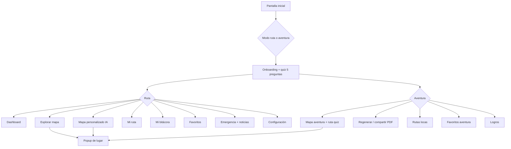

# Twinmap — Flujo de la aplicación

Twinmap es una aplicación web para **planificar y explorar turismo en El Salvador**. Combina mapas, cuestionario de preferencias, itinerarios, bitácora, favoritos y contexto local (emergencias y noticias por zona) en dos perfiles: **Modo ruta** (planificación) y **Modo aventura** (exploración gamificada).

**Entrada principal:** `frontend/index.html` (SPA por vistas con `data-panel` / `data-view`).

## Diagrama general del flujo

## Pantalla inicial: selección de modo

- Vista `mode-select`: el usuario elige **Modo ruta** o **Modo aventura**.
- El modo elegido se guarda en **sessionStorage** (`twinmap-mode`) y define la barra de navegación (`nav--ruta` vs `nav--aventura`).
- Desde **Configuración** se puede volver a cambiar de modo.

## Quiz / onboarding (5 preguntas)

1. Tras elegir modo, si el onboarding no está completado, se muestra la vista `onboarding`.
2. **Bienvenida** → **Comenzar** → **5 preguntas** de opción múltiple (sin texto libre).
3. Preguntas por modo:
   - **Ruta:** clima, paisaje, biodiversidad, multitudes, entorno laboral.
   - **Aventura:** entorno, experiencia, escenarios, intensidad, ambiente.
4. Respuestas persistidas; entrada a la app del modo elegido.
5. **Repetir cuestionario** en aventura (y desde configuración) puede regenerar la ruta.

## Modo ruta

### Dashboard / inicio (`inicio-app`)

Recomendaciones, logros con **Ver todo**, panel de IA, enlace al mapa personalizado, novedades (placeholder).

### Explorar mapa (`mapa`)

Mapa simulado, búsqueda/filtros, popup de lugar, añadir a **Mi ruta** y **Favoritos**.

### Mapa personalizado (`mapa-personalizado`)

Motor de reglas sobre ~20 destinos, filtros por zona/categoría, resumen textual, **ruta perfecta** de 5 paradas; usa quiz, bitácora simulada y favoritos.

### Mi ruta (`mi-ruta`)

Itinerario editable en localStorage; badge en nav; evento `twinmap-route-change`.

### Mi bitácora (`bitacora`)

12 visitas de ejemplo, filtros por categoría, galería simulada, **Ver todo** desde dashboard.

### Favoritos (`favoritos`)

Mock semilla + guardados (`twinmap-favoritos`).

### Emergencia + noticias (`emergencia`)

6 números reales de El Salvador; noticias mock por zona + RSS vía proxies; zonas según ruta activa.

### Configuración (`configuracion`)

Repetir quiz, restablecer onboarding, cambiar modo.

## Modo aventura

### Mapa (`aventura-mapa`)

Ruta de 5 paradas desde el quiz; **Regenerar ruta**; **Comparte con tus amigos** (PDF/impresión); repetir cuestionario.

### Rutas locas (`aventura-bitacora`)

Bitácora con etiquetas y calificación (`twinmap-aventura-bitacora`).

### Favoritos (`aventura-favoritos`)

Lista separada (`twinmap-aventura-favoritos`).

### Logros (`aventura-logros`)

Insignias según progreso; evento `twinmap-aventura-route-change`.

## Popup de lugares

Detalle del POI; clima **3 días (mock)**; **Waze**; **Viaje con Uber** (roadmap: **inDrive** en `resumen-ejecutivo.html`); noticias cercanas; añadir a ruta / favorito.

## localStorage y sessionStorage

| Clave | Almacén | Uso |
|-------|---------|-----|
| `twinmap-mode` | session | Modo activo |
| `twinmap-onboarding-ruta` / `twinmap-onboarding-aventura` | local | Onboarding hecho |
| `twinmap-quiz-ruta` / `twinmap-quiz-aventura` | local | Respuestas JSON |
| `twinmap-route-itinerary` | local | Mi ruta |
| `twinmap-favoritos` | local | Favoritos ruta |
| `twinmap-aventura-route` | local | Ruta aventura |
| `twinmap-aventura-favoritos` | local | Favoritos aventura |
| `twinmap-aventura-bitacora` | local | Rutas locas |

## Mock vs funcional

- **Funcional (cliente):** navegación, quiz, itinerario, favoritos, ruta aventura, motor de personalización, emergencias (números).
- **Mock/simulado:** mapas visuales, catálogo en JS, clima popup, bitácora ruta, parte de noticias, perfil.
- **Híbrido:** noticias (mock + RSS externo).
- **Backend:** no incluido en repo (carpeta `backend/` ignorada).

## Backend necesario (breve)

Auth/perfiles; catálogo POI; recomendaciones; persistencia de rutas y bitácoras; APIs clima/noticias con caché; routing real; PDF/compartir; secretos en `.env` en servidor.

## Referencias

- `frontend/resumen-ejecutivo.html`
- Módulos JS en `frontend/src/js/`

## Backend y datos reales

El backend Express (`server.js`) vive en la raíz del repo (rama `feature/mapa-datos-integrados`, ya mergeada en `main`). El frontend consume la API vía `frontend/src/js/api.js`. Ver `documentacion/API.md`.
